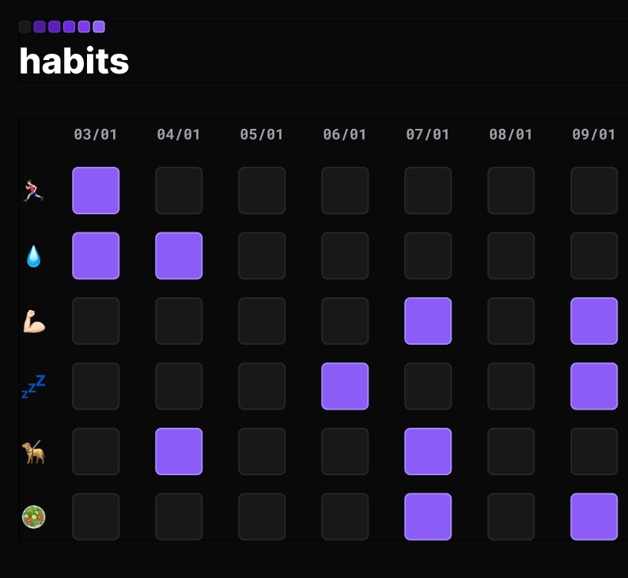

# nlw-habits
<h1 align="center">Registro de Hábitos Diários</h1>

  <a href="#-tecnologias">Tecnologias</a>&nbsp;&nbsp;&nbsp;|&nbsp;&nbsp;&nbsp;
  <a href="#-projeto">Projeto</a>&nbsp;&nbsp;&nbsp;|&nbsp;&nbsp;&nbsp;
  <a href="#-layout">Layout</a>&nbsp;&nbsp;&nbsp;|&nbsp;&nbsp;&nbsp;
  <a href="#memo-licença">Licença</a>

  

 

  

## 🚀 Tecnologias

Esse projeto foi desenvolvido com as seguintes tecnologias:

- HTML e CSS
- JavaScript
- Git e Github
- Figma

## 💻 Projeto

Calendário com registro de hábitos diários. Irá auxiliar no desenvolvimento de hábitos de vida saudáveis para o novo ano de 2023. 
Comece agora as mudanças na sua vida que irão te ajudar a alcançar seus objetivos!

## 🔖 Layout

Você pode visualizar o layout do projeto através [DESSE LINK](https://www.figma.com/community/file/1195327109778210238). É necessário ter conta no [Figma](https://figma.com) para acessá-lo.

## :memo: Licença

Esse projeto está sob a licença MIT.

---

Evento exclusivo e gratuito, promovido pela Rocketseat para ensino de tecnologias WEB.
:wave: [Participe da nossa comunidade!](https://discord.gg/rocketseat)
